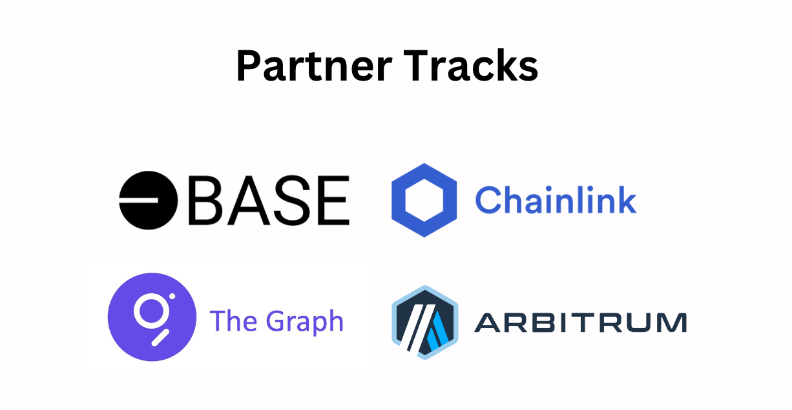
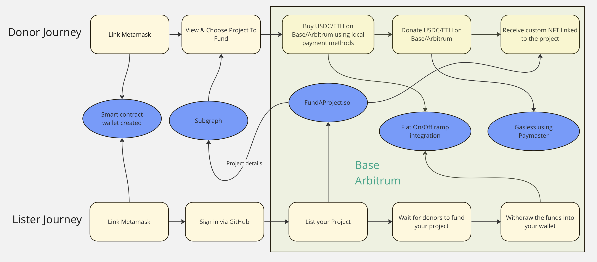

<br>


# Gitfund

Built for ETHDenver2024 Hackathon

## Introduction

Gitfund is a platform for crowd-funding open source GitHub projects. It combines the power of crypto with the simplicity of web2.

## Motivation

Open-source projects don't get funded easily. Current players like Github sponsors and Gitcoin are not able to address the issue adequeately.

The problems:

1. **Limited Funding Options:** Traditional platforms limit donations to fiat currencies or predefined funding mechanisms, limiting reach and flexibility.
2. **Complexity of Crypto Transactions:** Many potential donors find cryptocurrency transactions complex and intimidating.
3. **High TAT:** Both time taken by a builder to list a project and the time taken by a donor to fund a project are extremely high due to the complex UX of current solutions.

We built a platform that leverages cryptocurrencies while ensuring web2 like UX to solve for this.

Video : <a style="margin-bottom: 5px;" href="" target="_blank"> Link </a>

## Tech Stack



### Chains:

1. Base

```
  usdc: 'https://sepolia.basescan.org/address/0xd733d48f2a7f57d4559f98ae07f87dab595e3523',
  nft: 'https://sepolia.basescan.org/address/0x8d68915F87C60c1e14062567BbB2DE2264cAbaa6',
  main: 'https://sepolia.basescan.org/address/0x1127ac9A60f5ef63dD40c3fb660bCE67020cfEa5',
```

2. Arbitrum

```
  usdc: 'https://sepolia.arbiscan.io/address/0x0c86a754a29714c4fe9c6f1359fa7099ed174c0b',
  nft: 'https://sepolia.arbiscan.io/address/0x54fc2becfe4f552fe516350a3078e14c86e045fa',
  main: 'https://sepolia.arbiscan.io/address/0x81ab54a29985de453602197682132a2a8e904c7d',
```

### The Graph:

For subgraphs

```
84532: 'https://api.studio.thegraph.com/query/67099/gitfund-base/version/latest',
421614: 'https://api.studio.thegraph.com/query/67099/gitfund-arbitrum/version/latest',

```

### Chainlink:

For price feeds

### Alchemy:

For smart contract wallets and gasless transactions.

### Transak:

For On/Off ramps.

## Implementation Details



## Getting Started

## Steps to Run the Project

1. Clone the repo

```
git clone https://github.com/
```

2. Install the dependencies.

```
 npm i
```

3. Start the app using command

```
npm start
```

4. Open this link in browser http://localhost:3000

5. Hey, You just ran the code in your system, thats it. Open [http://localhost:3000](http://localhost:3000) with your browser to see the result.

<br>
